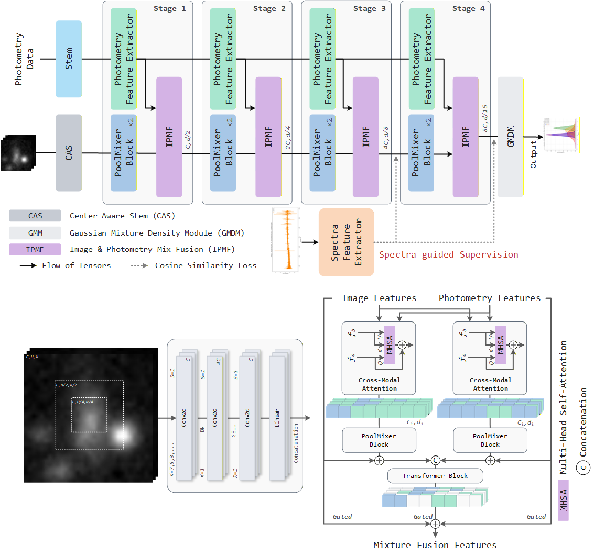

# Photometric Redshift Estimation via Image and Photometry with Spectra-guided Gaussian Mixture Density Network

<div align="center">


</div>

Galaxy photometric redshifts play an important role in cosmology and in studies of the cosmic large-scale structure.
Next-generation surveys will produce tens of billions of observations, creating a strong need for redshift estimation
methods that are both accurate and computationally efficient. However, template-fitting or machine-learning-based
photometric redshift estimators commonly used in astronomy often either lack sufficient accuracy or fail to meet the
throughput requirements imposed by massive datasets. Moreover, because photometric images and photometry data differ
from natural images in their features and structure, feature extractors that perform well on natural-image tasks tend to
underperform when transferred directly to photometric redshift estimation. To address these challenges, we propose
PRISM (Photometric Redshift Estimation via a Spectrum-guided Gaussian Mixture Density Framework), a multimodal framework
that combines a photometric-image modality, composed of multi-band images, with a photometry-data modality. PRISM
incorporates advanced feature-extraction methods, along with structural adaptations tailored to astronomical data, and
employs a spectra-guided supervised training scheme to help the model learn feature representations associated with
spectral data. The framework adopts a Gaussian mixture density module as the regressor, producing a probability density
function for the photometric redshift rather than a deterministic point estimate. We constructed a galaxy redshift
dataset containing 198 million samples from the Dark Energy Spectroscopic Instrument Data Release 1 and performed
five-fold cross-validation experiments on it. Compared with the best-performing baseline model, PRISM reduced the mean
absolute error and outlier fraction by 17.1% and 20.0%, respectively.



## Installation

Clone the repository and install dependencies:

```bash
git clone https://github.com/qintianjian-lab/PRISM
cd PRISM
pip install -r requirements.txt
git submodule update --init --recursive
```

## Data Preparation

Set the dataset location in `config/config.py`:

```python
config["dataset_root_dir"] = "/path/to/your/dataset"
config["hdf5_file_name"] = "dataset.h5"
config["label_dir_name"] = "label"
```

For five-fold experiments, the expected label layout is:

```text
/path/to/your/dataset/
|-- dataset.h5
`-- label/
    |-- fold_0/
    |   |-- train.csv
    |   |-- val.csv
    |   `-- test.csv
    |-- fold_1/
    `-- ...
```

Each label CSV should contain the following required columns:

| Column             | Description                                                     |
|--------------------|-----------------------------------------------------------------|
| `TARGETID`         | DESI target identifier                                          |
| `TARGET_RA`        | Right ascension                                                 |
| `TARGET_DEC`       | Declination                                                     |
| `Z`                | Spectroscopic redshift label                                    |
| `h5_index`         | Row index in the HDF5 arrays                                    |
| `south_north_flag` | Source/domain flag used for grouped evaluation                  |
| `magnitudes*`      | Photometric magnitude features                                  |
| `magnitudes_diff*` | Color-difference features                                       |
| `h5_file`          | Optional per-row HDF5 path; if absent, `hdf5_file_name` is used |

The HDF5 file is expected to provide:

| Key           | Description                          |
|---------------|--------------------------------------|
| `photo_flat`  | Flattened image cutouts              |
| `photo_shape` | Original shape for each image cutout |
| `spec_flat`   | Flattened spectral arrays            |
| `spec_shape`  | Original shape for each spectrum     |

The dataloader reconstructs image cutouts from `photo_flat/photo_shape`, normalizes the image channels with
`photo_min_max`, resizes them to `photo_in_size`, concatenates magnitude and color features, and loads spectra for the
auxiliary alignment loss during training.

## Configuration

Main settings live in `config/config.py`.

Important options include:

| Key                                  | Purpose                                                   |
|--------------------------------------|-----------------------------------------------------------|
| `used_device`                        | GPU IDs available for training                            |
| `batch_size`, `epochs`, `precision`  | Training scale and numerical precision                    |
| `photo_in_channel`, `photo_in_size`  | Input image channel count and cutout size                 |
| `mag_in_size`                        | Magnitude plus color feature length                       |
| `out_channel`                        | Number of Gaussian mixture components                     |
| `enable_wandb`, `wandb_project_name` | Weights & Biases logging                                  |
| `spectrum_pretrained_ckpt_dir`       | Directory containing fold-specific SSCNN checkpoints      |
| `spectral_supervised_layers`         | PRISM feature stages aligned to spectral embeddings       |
| `loss_weights`                       | Mixture NLL temperature and spectra-alignment loss weight |

The default setup uses five Gaussian mixture components and expects DESI `g/r/z` image channels.

## Training

Train one fold:

```bash
python train.py --cross_validation_fold_name fold_0 --random_seed 42
```

Run a quick debug pass:

```bash
python train.py --cross_validation_fold_name fold_0 --debug
```

## Inference and Evaluation

`predict.py` contains the default five-fold checkpoint mapping in `PRED_CONFIG`:

```python
PRED_CONFIG = {
    "list": [
        {
            "model_name": "PRISM",
            "ckpt_name": {
                "fold_0": "...",
                "fold_1": "...",
                "fold_2": "...",
                "fold_3": "...",
                "fold_4": "...",
            },
        },
    ],
    "save_path": "./results/DATASET_1.9M",
}
```

Run inference with the configured checkpoints:

```bash
python predict.py --clear --infer-precision bf16
```

Use full precision inference if needed:

```bash
python predict.py --clear --infer-precision fp32
```

The script writes fold-level outputs and an all-fold summary under `results/`:

```text
results/DATASET_1.9M/PRISM/
|-- fold_0/
|   |-- result.csv
|   `-- result.json
|-- fold_1/
|-- ...
`-- all_folds/
    |-- result.csv
    `-- result.json
```

`result.csv` contains per-object predictions, residuals, likelihood metrics, CRPS values, and exported Gaussian mixture
parameters. `result.json` contains aggregate metrics, redshift-binned metrics, PIT calibration metrics, inference
throughput, and grouped metrics by `south_north_flag`.

## Model Summary

To inspect the configured network:

```bash
python summary.py
```

This runs `torchinfo.summary` with the current configuration.

## Citation

```bibtex
# In prep.
```
