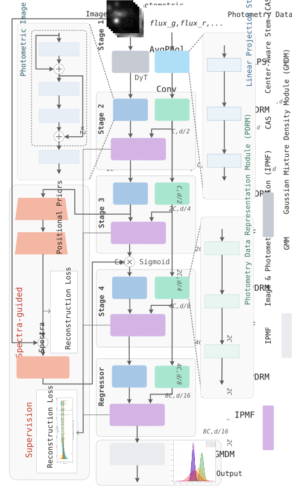

# PRISM: Photometric Redshift Estimation via Image and Photometry with Spectra-guided Gaussian Mixture Density Framework

<div align="center">

 

</div>



## Requirements

1. Clone this repo in your directory and enter the repo directory.

   ```bash
   git clone https://github.com/qintianjian-lab/PRISM.git
   cd ./PRISM
   ```

2. Create `conda` environment (`python >= 3.9`) and activate the environment.

   ```bash
   conda create -n prism python=3.9
   conda activate prism
   ```

3. Install all requirement.

   ```bash
   pip install -r requirements.txt
   ```

4. Training model with `./config/config.py`.

   ```bash
   python train.py
   ```

## Dataset

Your dataset directory must follow the format below:

```
dataset
|- label
	|- fold_0
		|- train.csv
		|- val.csv
		|- test.csv
	|- fold_1
		|- ...
	|- fold_2
		|- ...
	|- fold_3
		|- ...
	|- fold_4
		|- ...
|- spec
	|- xxx.npy
	|- yyy.npy
	|- zzz.npy
	|- ...
|- photo
	|- xxx.npy
	|- yyy.npy
	|- zzz.npy
	|- ...
```

## Dataset Catalog

- DESI & WISE Dataset: `./public/DESI&WISE.csv`
- DESI Only Dataset: `./public/DESI_Only.csv`

## Citation

```tex
// In prep.
```

